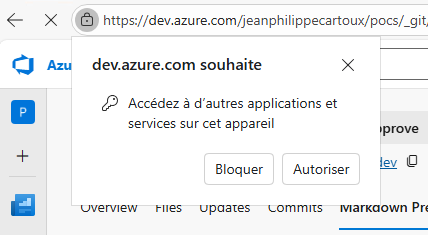

# Dev

## Release

> npx webpack --mode production

Ensuite vous devez changer le numéro de version dans vss-extension.json.

Vous allez pouvoir packager l'extension en mode "dev" :

> npx tfx-cli extension create --manifest-globs vss-extension.json --overrides-file configs/release.json

## Debug

Il faut compiler l'app pour générer le dist/ :

> npx webpack --mode development

Ensuite vous devez changer le numéro de version dans vss-extension.json.

Vous allez pouvoir packager l'extension en mode "dev" :

> npx tfx-cli extension create --manifest-globs vss-extension.json --overrides-file configs/dev.json

Déployez l'extension dans marketplace, Si c'est votre première application alors vous allez devoir l'installer sur votre Azure DevOps, sinon elle se mettra automatiquement à jour.

À la suite de tout ça, vous allez pouvoir lancer l'application localement via :

> npx webpack-dev-server --mode development

Ouvrez dans le navigateur l'url, et ignorer l'alert du certificat car nous sommes en locahost\* :

[Site local](https://localhost:3000/dist/PrMarkdownPreview/PrMarkdownPreview.html)

Vous avez à approuver une notification de votre navigateur, car du contexte du site https://dev.azure.com/ notre extension souhaite communiquer avec le localhost :

\* Si vous avez un soucis comme quoi l'extension met du temps à charger refaite cette étape !

Les [icônes](https://www.flicon.io/).